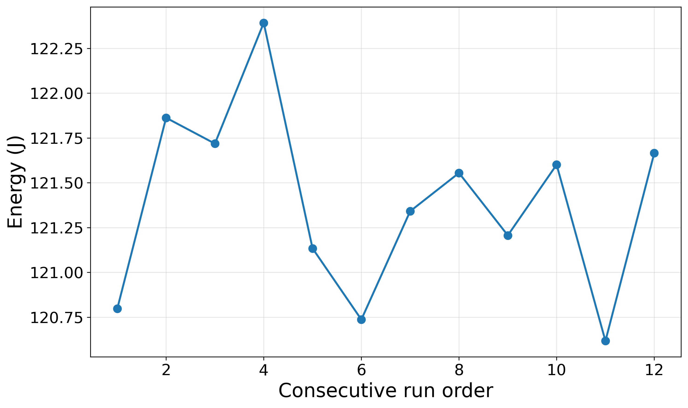
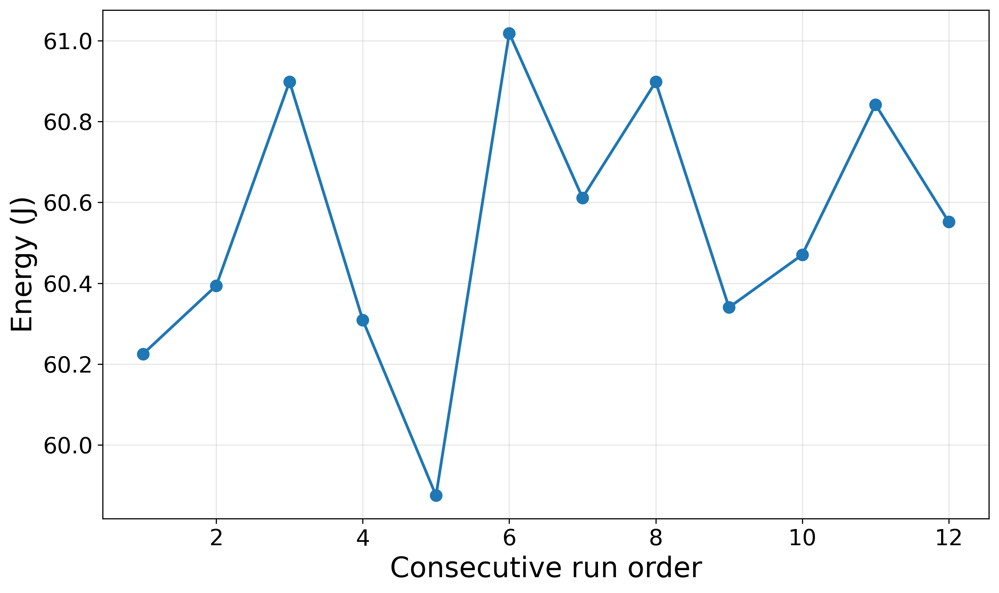
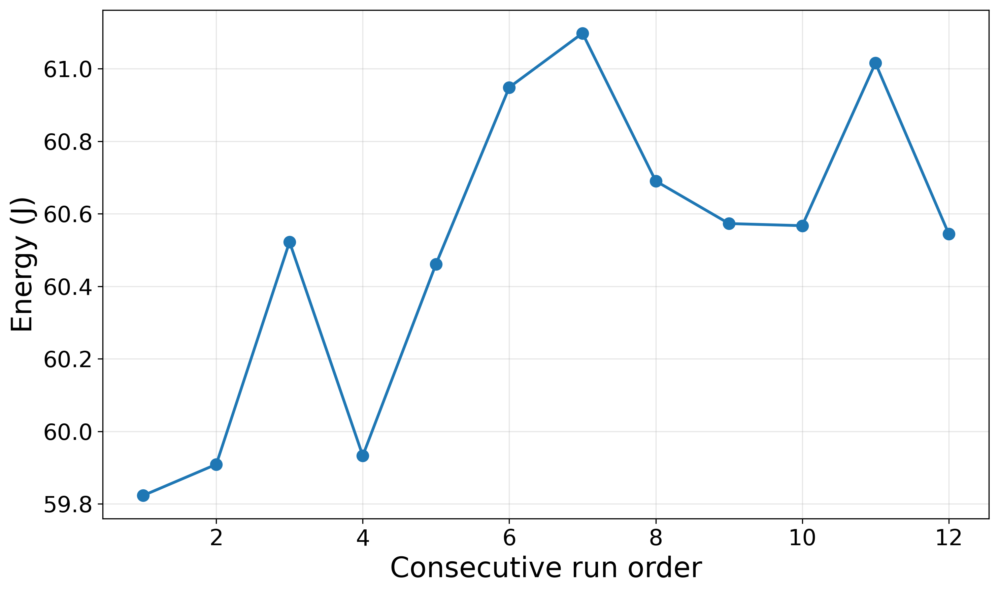
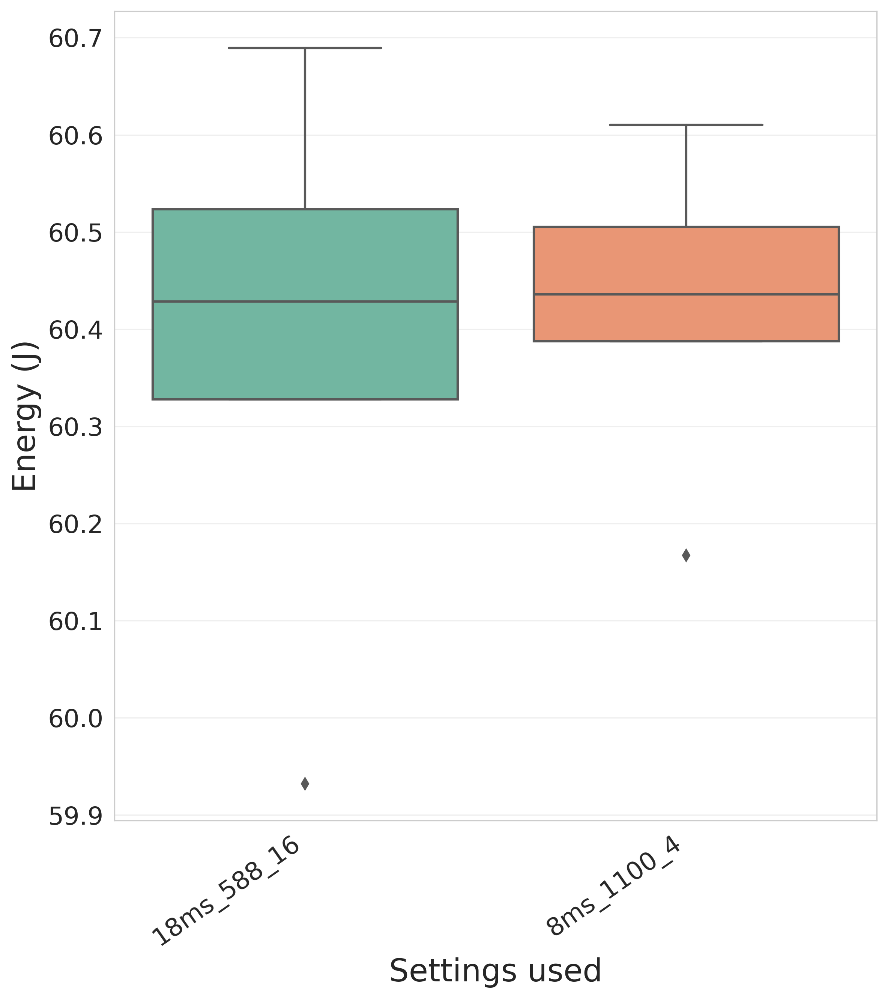
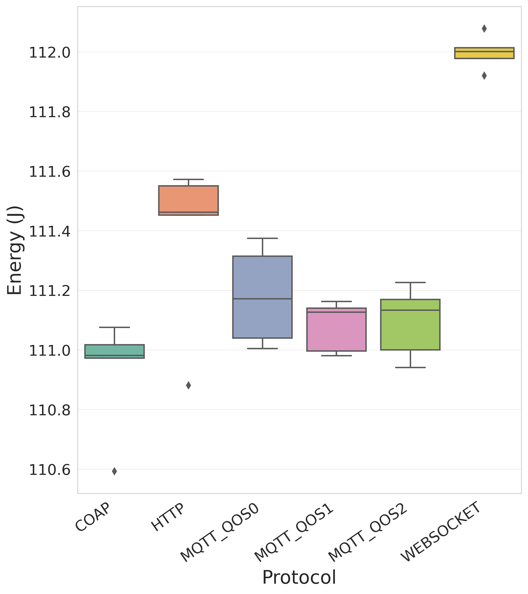
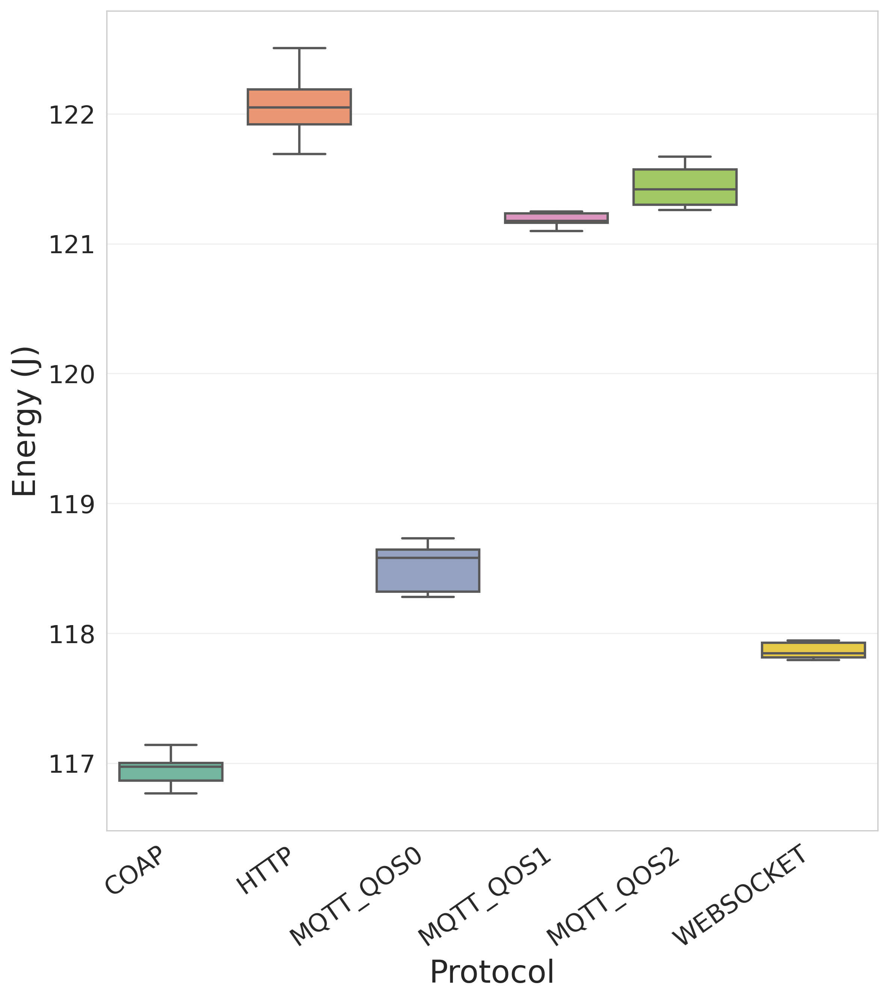

# master_thesis_energy_usage_esp32
Master thesis repository for scripts and data used in thesis/ paper

> [!NOTE]
> **Naming note:** The code refers to benchmarks by type number (`type 1`, `type 2`). `type 1` corresponds to **light** in paper, readme and thesis. `type 2` corresponds to **intermediate** in the thesis, and **heavy** in the paper and readme.
>
> 

---

## Parquet ↔ CSV Conversion
The datasets in this repository are stored in Parquet format for efficiency. If needed, they can be converted to and from CSV using common Python tools such as pandas and pyarrow.

### Convert Parquet to CSV

```bash
python -c "
import pandas as pd
df = pd.read_parquet('input.parquet')
df.to_csv('output.csv', index=False)
"
```

### Convert CSV to Parquet

```bash
python -c "
import pandas as pd
df = pd.read_csv('input.csv')
df.to_parquet('output.parquet', index=False)
"
```

Required dependencies:

```bash
pip install pandas pyarrow
```

---

## Experimental Data for Figures

This repository includes the raw data used to generate the figures in the paper:

* **`cooldown_1min_dur_6min/`**
  Contains the data representing
  *Energy used (J) over consecutive runs of the heavy HTTP benchmark, with 60 seconds cooldown between runs and runs of 6 minutes.*

  <p align="center">
    
  </p>

* **`cooldown_1min_dur_3min/`**
  Contains the data representing
  *Energy used (J) over consecutive runs of the heavy HTTP benchmark, with 60 seconds cooldown between runs and runs of 3 minutes.*

  <p align="center">
    
  </p>
  

* **`cooldown_0min_dur_3min/`**
  Contains the data representing
  *Energy used (J) over consecutive runs of the heavy HTTP benchmark, with 0 seconds cooldown between runs and runs of 3 minutes.*

  <p align="center">
    
  </p>

* **`ina_settings_assessment/`**
  Contains the data representing
  *Energy (J) used by HTTP heavy benchmark with runs of 3 mins with different settings of INA226. 18ms window at 0.588 ms conversion speed and averaging of 16 samples (on the left) and 8ms window at 1.1 ms with averaging of 4 samples (on the right)*

  <p align="center">
    
  </p>

* **`CSV_Benchmark_1_2_parquet/`**
  Contains the data for representing
  *Energy (J) used by a single run while executing light benchmark and heavy benchmark*, The data is provided in parquet format, each folder inside `CSV_Benchmark_1_2_parquet/` represents a protocol tested, inside each protocol folder there are the various CSV (in parquet format) obtained from running the pipeline script.

  <p align="center">
    
    
  </p>

---

## Pipeline Overview

The pipeline is orchestrated by `pipeline runner mk2.py`, which
follows the instructions dictated by the configuration file
(`pipeline config.json`) that defines the order and execution
context of each processing script.
The pipeline is organized into three distinct phases, each
targeting a specific directory level within the project structure.

### Phase 1: Experiment folder level

The first phase acts on each experiment folder, performing:

- `01 energy calculation.py`  
  Calculates energy consumption
  in Joules for each measurement section using the formula
  E = P × ∆t (we use rectangular rule for our discrete
  approximation of energy formula). Power
  measurements in milliwatts are converted to watts and
  time intervals ∆t = current time − previous time
  are converted from milliseconds to seconds. The calculated energy values are appended as a new column
  (energy used by section) to the existing dataset.

- `02 energy aggregator.py`  
  Aggregates the energy values
  by grouping data according to `current runs` and `current benchmark`, summing the `energy used by section`
  values to produce `total energy J` for each unique combination of run and benchmark. The aggregated values
  are rounded to four decimal places.

- `03 add prot col and order.py`  
  Adds protocol column,
  sorts the data by `current benchmark` and by `current runs`,
  Renames the resulting file from this operations by `appending to merge`

### Phase 2: Base directory level

The second phase operates at the base directory level running:

- `04 merge all protocol csvs.py`  
  Recursively searches all
  subdirectories for files with name ending in `master energy to merge.csv`, concatenates them into a single
  DataFrame, and sorts the unified dataset by protocol,
  benchmark, and run number. The merged output is saved
  as `all protocols master energy.csv` in a newly created
  directory called results.

### Phase 3: Results directory level

The third phase operates in the results directory running:

- `05 do boxplot.py`  
  A boxplot is created from
  `all protocols master energy.csv` for each benchmark
  level collected, each containing all protocols tested under
  that benchmark level.

- `06 kruskall wallis.py`  
  Executes Kruskal-Wallis tests to
  compare energy consumption across protocols for each
  benchmark. If significant differences are detected the
  script performs post-hoc pairwise Mann-Whitney U tests  10
  with Bonferroni correction to identify which protocol
  pairs differed significantly. Descriptive statistics are computed too.

- `07 check practical difference.py`  
  Calculates pairwise absolute differences between the median energy usage of
  protocols. It then compares the resulting absolute differences against a MAD based standard deviation threshold
  provided by the user to determine whether the difference
  is practically significant.

---

## Data collection start and stop procedure

In order to collect the data a specific system initialization
procedure needs to be followed:
1) Execute the Python script
`master_serial_to_csv_mk3.py` to collect
serial data from the Arduino in the folder where we
want to save all our measurements.
2) Power on the Arduino by plugging it into laptop.
3) Power on the broker (in the case of MQTT).
4) Power on the ESP32 receiver or start the subscriber on
the laptop (in the case of MQTT).
5) Power on the ESP32 sender by plugging in our USB-C
PD trigger module.

In order to stop collecting the data and save all data
collected so far: 
1) Press Ctrl+c on the terminal running
`master_serial_to_csv_mk3.py`, by doing
this all data collected so far will be saved in a folder in
CSV.
2) Power off the ESP32 sender by un-plugging our USB-C
PD trigger module.
3) Power off the Arduino by un-plugging it from laptop.
4) Power off/ stop receiver and broker if available.

---

## Software Versions

| Software | Version |
|---|---|
| Arduino IDE | 2.3.6 |
| Arduino ESP32 core | 3.3.0 |
| INA226.h | 0.6.4 |
| Mosquitto | 2.0.18 |
| ArduinoMqttClient.h | 0.1.8 |
| coap-simple.h | 1.3.28 |


